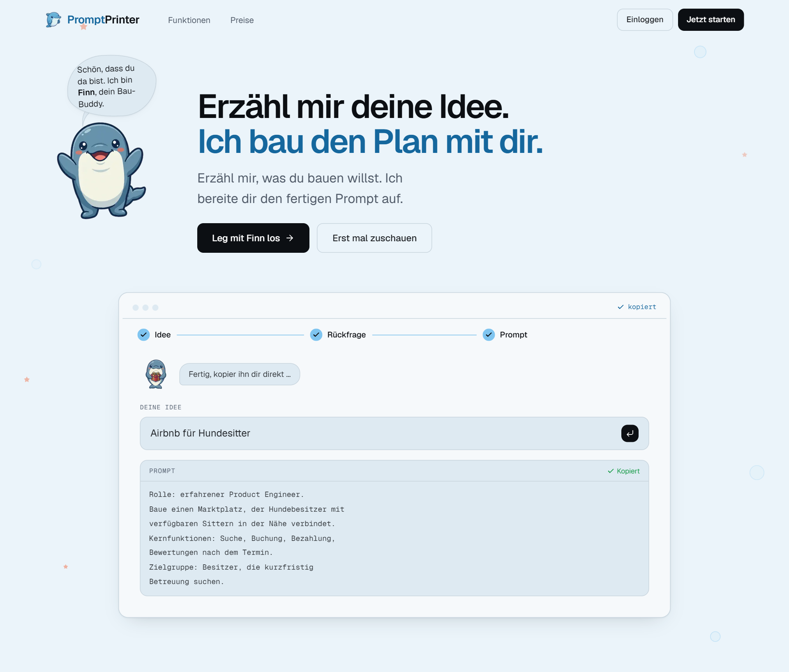

# PromptPrinter

**Der KI-Chat, der nachfragt, bevor du Credits verbrennst.**

Finn stellt die Rückfragen, die dein Bau-Tool nie stellt, und liefert dir den
fertigen Prompt für Lovable, Cursor, v0, Claude Code, Bolt und Co.

[**promptprinter.app**](https://promptprinter.app)

  

## Was ist PromptPrinter?

Wer eine App mit Lovable oder Cursor baut, tippt oft drei Sätze, und das Tool
legt los. Es fragt nicht nach Datenbank, Login oder Design, es rät. Jede falsche
Annahme kostet eine Korrekturrunde, und die kostet Credits.

PromptPrinter setzt einen Schritt davor. Du erzählst Finn, was du bauen willst.
Er stellt **eine** gebündelte Rückfrage und schreibt dir danach einen Prompt, der
für sich steht.

1. **Idee erzählen**, so grob, wie sie gerade ist.
2. **Eine Rückfrage beantworten**: Ziel-Tool, Kern-Screens, Datenmodell, Login,
   Design-Richtung.
3. **Prompt kopieren** und ins Bau-Tool einfügen.

## Funktionen

- **Rückfrage statt Raten.** Finn fragt nur, was für deine Idee zählt, und lässt
  Offenes als sichtbare Lücke stehen, statt etwas zu erfinden.
- **Zugeschnitten auf dein Tool.** Lovable, Cursor, v0, Claude Code, Bolt oder
  Replit. Nach jeder Änderung bekommst du den ganzen Prompt neu, nie nur einen
  Ausschnitt.
- **Fotos und Dateien anhängen.** Ein Screenshot oder eine Anforderungsliste an
  die Nachricht, Finn sieht sie und baut den Prompt darauf. Die Anhänge bleiben
  im Chat.
- **Projekte.** Anweisungen, Struktur, Dateien und mehrere Chats an einem Ort,
  damit du nicht in jedem Chat von vorn erklärst.
- **Projekt-Gedächtnis.** Dateien oder ein öffentliches GitHub-Repo einmal
  analysieren lassen. Finn kennt danach Framework, Datenbank, Design-System und
  Konventionen.
- **Prompts speichern.** Gute Prompts im Projekt sichern, als Markdown oder (Pro)
  als PDF exportieren.
- **Sprachmodus.** Idee einsprechen statt tippen.
- **Eigener API-Key.** Anthropic, OpenAI, Gemini oder jeder OpenAI-kompatible
  Endpunkt. Mit eigenem Key ist der Free-Plan gratis, [Pro](https://promptprinter.app/pricing)
  läuft ohne.
- **Fünf Sprachen.** Die App gibt es auf Deutsch, Englisch, Französisch,
  Italienisch und Spanisch, in hell und dunkel.

## Tech-Stack

**Next.js 15** · **React 19** · **TypeScript** (strict) · **Supabase** (Auth,
Postgres, Row-Level-Security) · **Tailwind** · **Framer Motion** · **Vitest** ·
**Vercel**

Dazu Z.ai (GLM) und Gemini als Modelle, Lemon Squeezy für Zahlungen und Upstash
für das Rate-Limiting. Über 1.200 Tests, dazu Guard-Tests, die Schichtgrenzen,
Routen, Kontraste und SEO-Metadaten festhalten.

Setup, Deploy-Checkliste und Projektstruktur stehen in
[docs/SETUP.md](docs/SETUP.md), die Design-Regeln in [docs/DESIGN.md](docs/DESIGN.md).

## Lizenz

Der Quellcode ist **nur zum Ansehen** veröffentlicht. Nutzen, Kopieren, Verändern
und Weitergeben sind nicht erlaubt. Die Details stehen in [LICENSE](LICENSE).

Gebaut von [Kasum Bajrami](https://github.com/BajKasum) in Basel.

